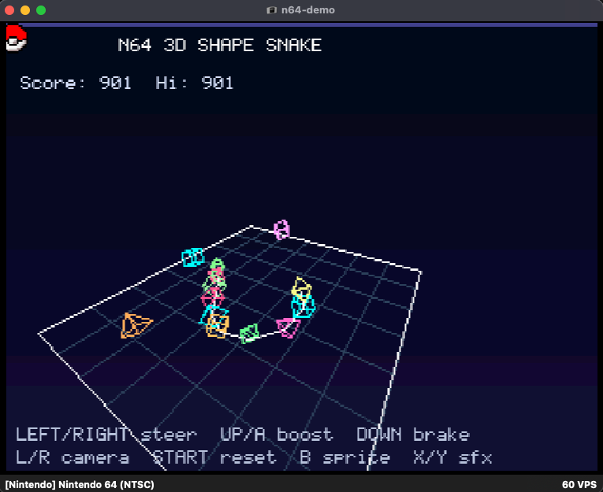

# Nintendo 64 Work

This document tracks two related Nintendo 64 efforts in Kengine:

- The N64-inspired 3D platformer stack: a reusable late-1990s console-style gameplay, camera, animation, collision, asset, and renderer baseline.
- The longer-range Kotlin/Native target work: extending the current Kengine Kotlin/Native Nintendo Switch compiler branch and build-harness approach so it can eventually support a Nintendo 64 target too.

The goal is not to ship ROMs, proprietary SDK content, or an emulator in this repo. The goal is to keep the game-facing N64-style work productive on desktop while we separately investigate whether our Kotlin/Native fork and portable runtime architecture can target actual N64 homebrew-style builds.

## Current Direction

### N64-Style 3D Track

The main validation bed is `games:mario-3d`. It already exercises a Mario 64-style third-person platformer loop with imported GLB assets, terrain collision, camera-relative movement, animation, enemies, collectibles, and a GPU UI HUD.

The engine work behind that demo lives mostly in:

- `kengine-3d`: SDL GPU rendering, cameras, model loading, animation, scene submission, collision helpers, debug rendering, and GPU resource management.
- `kengine-3d-ui`: GPU-compatible UI controls and text rendering for 3D windows.
- `kengine-3d-model-viewer`: model inspection, preset loading, animation playback, lighting/background tuning, and asset diagnostics.
- `kengine-3d-importer`: preflight boundary for runtime-ready model formats versus source formats that must be exported externally.
- `kengine-math`: common math primitives shared by core, desktop 3D, Switch, and N64 harness code.
- `tools/extract_glb_animations.py`: extracts the repo-safe animated Mario GLB from the larger local source asset.

### Kotlin/Native Target Track

The compiler/build target work is the highest-priority N64 work. It should learn from the Switch path instead of starting over architecturally, but it should not share a Kotlin fork with Switch until the overlap is proven. Today, `kengine-kotlin` manages a sibling Kotlin fork for the experimental `switch_arm64` Kotlin/Native target, and `kengine-nintendo-switch` proves the shape we want: opt-in Gradle tasks, direct `kotlinc-native`/`cinterop` invocation from Kengine tasks, Kotlin static libraries, a small C host, converted assets, and portable command buffers owned by `:kengine-core`.

For Nintendo 64, the target name, ABI, linker flow, C host/toolchain, runtime constraints, and packaging format are still open decisions. Until those are resolved, the N64 target work should live in a separate local Kotlin fork, expected to be `kengine-kotlin-n64`, and should stay focused on compiler/runtime feasibility rather than production game code. A unified `kengine-kotlin-console` fork may make sense later, but not before Switch and N64 have both proven their target-specific probes.

### Portable 2D Hardware Track

`games:boxxle-n64` is the first real game-facing N64 ROM wrapper. It imports shared gameplay and assets from `games:boxxle-core`, proving the same `PortableGame` command-buffer surface used by desktop/Switch can also feed the N64 host path. The initial N64 target uses sprite-sheet rendering and SFX; large desktop music assets stay in the core catalog for desktop/Switch but are intentionally ignored by the N64 asset import until compressed or streamed music is designed.

### N64 3D Foundation Probe

`games:n64-demo` now carries the first N64 3D gameplay probe: a wireframe 3D shape-snake game that projects `Vec3` geometry into the existing 2D command buffer. This is intentionally not a final renderer. It proves camera math, projection, shape definitions, movement, pickup spawning, growth, and command-budget discipline before we add RDP/RSP-specific 3D rendering paths.

## Working Principles

- Keep runtime assets in GLB, GLTF, or OBJ. Source formats such as FBX, USD, and USDZ should be exported outside the runtime before Kengine loads them.
- Keep the runtime loader small and predictable. Do not add Blender, Assimp, FBX SDK, or USD dependencies to game runtime code.
- Keep the N64 work game-facing first. Features should be proven in `games:mario-3d` or the model viewer before becoming reusable engine APIs.
- Prefer clear low-poly, readable silhouettes, simple lighting, chunky textures, and stable controls over high-fidelity rendering.
- Keep proprietary or oversized source assets out of the repo. The repo can contain the smaller runtime-ready assets we are allowed to keep.
- Keep the Kotlin/Native target work opt-in and machine-local, following the Switch model. Normal Kengine builds must continue to use the stock Kotlin Gradle plugin.
- Do not destabilize `switch_arm64` while experimenting with an N64 target. Shared fork/tooling changes should make both targets easier to maintain.
- Keep any real N64 backend on the portable `:kengine-core` surface first. Do not depend on SDL, desktop `:kengine`, or modern GPU APIs for the hardware-target path.
- Treat a standalone `kengine-n64` or `kengine-nintendo-64` module as acceptable, even if it is separated from desktop Kengine and Switch internals. Reuse should be earned by constraints, not forced.
- Keep shared math in `:kengine-math` so low-level renderer, model, collision, and command-buffer code can use the same types without depending on SDL or desktop engine modules.
- Use software-projected wireframe demos as cheap N64 3D design probes, then promote only the stable parts into reusable N64 renderer code.

## Emulator Compatibility

Modern libdragon uses custom RSP microcode (`rspq`) and sends raw RDP commands directly. This is how real N64 hardware works, but it is incompatible with emulators that use HLE (High-Level Emulation) for the RSP.

HLE RSP plugins (like mupen64plus's default `rsp-hle`) work by recognizing specific microcode patterns from Nintendo's official SDK (F3DEX, F3DEX2, S2DEX, etc.) and reimplementing them on the host CPU. They do not recognize libdragon's custom microcode, resulting in a black screen.

### Recommended Emulators

| Emulator | RSP Mode | libdragon Support | Notes |
|----------|----------|-------------------|-------|
| **ares** | LLE | Works | Recommended for homebrew development. Accurate hardware emulation. `brew install --cask ares-emulator` on macOS. |
| **simple64** | LLE (parallel-rsp/parallel-rdp) | Works | Also accurate. Good alternative to ares. |
| **mupen64plus** (default plugins) | HLE | Black screen | Default `rsp-hle` does not recognize libdragon microcode. |
| **mupen64plus** (parallel plugins) | LLE | Works | Requires `mupen64plus-rsp-parallel` and `mupen64plus-video-parallel` plugins (not in standard Homebrew package). |
| **Real N64 hardware** (EverDrive 64, 64drive) | N/A | Works | The ground truth. libdragon is designed and tested against real hardware. |

### Why This Matters

The black screen on mupen64plus does NOT indicate a broken ROM. Commercial N64 games used Nintendo's proprietary microcodes which HLE plugins know about. Homebrew with custom microcodes (all modern libdragon output) requires LLE — actual instruction-by-instruction emulation of the RSP hardware. Any ROM that runs on ares or simple64 will run on real N64 hardware via a flashcart.

## Current Assets

`games/mario-3d/assets/models` currently includes:

- `Super Mario 64 Bob-Omb Battlefield.glb`: textured world mesh used for rendering and terrain collision.
- `Mario 64 Model.glb`: static textured Mario mesh.
- `Mario64Animated.glb`: repo-safe animated Mario asset with skinned mesh, skeleton, textures, and gameplay clips.
- `Animated Goomba Super Mario Bros.glb`: node-animated Goomba enemy.
- `Super Mario 64 Bowser.glb`: static Bowser landmark/enemy mesh.
- `Ridley64.glb`: animated N64-era character test asset used by the model viewer.

The larger local Mario animation source remains outside the repo at `~/code/mario64-assets/assets/models/Mario 64 Odyssey All Animations 2025.glb`.

To regenerate the split animated Mario asset:

```shell
python3 tools/extract_glb_animations.py "$HOME/code/mario64-assets/assets/models/Mario 64 Odyssey All Animations 2025.glb" games/mario-3d/assets/models/Mario64Animated.glb
```

## Workstreams

### 1. Platformer Feel

- Keep camera-relative movement stable across keyboard and controller.
- Tune walk, run, crouch-walk, jump, double jump, long jump, backflip, falling, landing, damage, and braking states.
- Make movement transitions deterministic enough to test without flattening the game feel.
- Keep controller axis calibration and deadzone shaping reusable for other 3D games.
- Add better state debug output for animation and movement issues.

### 2. Camera

- Keep improving the third-person follow camera as a reusable `kengine-3d` system.
- Support orbit, follow smoothing, distance presets, pitch/yaw limits, collision-aware camera distance, and target height controls.
- Add camera preset/save controls to the model viewer.
- Add debug visualization for camera target, desired camera, actual camera, and obstruction tests.

### 3. Collision And World Interaction

- Improve terrain collision beyond the current height-aware baseline.
- Add slope limits, ledge handling, world bounds, richer static collision volumes, and debug overlays.
- Keep collision data reusable from parsed model source so rendering and gameplay share the same asset flow.
- Add enemy stomp volumes, damage volumes, collectible pickup volumes, and simple trigger zones as reusable helpers.
- Track collision regressions with small deterministic tests where possible.

### 4. Animation

- Keep Mario on the default `AUTO` animated skinning path, which uses GPU joint-palette skinning when the asset fits renderer limits and keeps CPU skinning as fallback.
- Continue exercising static models, node animation, CPU skinned animation, and GPU skinned animation in the model viewer.
- Map platformer movement states to named animation clips through reusable animation controllers.
- Add cleaner blend/transition support where abrupt clip changes hurt readability.
- Keep per-instance animated render state reusable for crowds or repeated enemies.

### 5. N64 Visual Style

- Define a deliberate N64-inspired visual profile: low-poly meshes, compact textures, crisp silhouettes, simple lighting, restrained material complexity, and readable fog/backgrounds.
- Add asset and renderer knobs for nearest/linear filtering, texture scale, draw distance, fog color, ambient strength, and directional light strength.
- Keep normal-map support available, but do not let it become the default look for N64-style content.
- Add model viewer presets that make asset style problems obvious before they reach the game.

### 6. Model And Asset Pipeline

- Keep GLB/GLTF/OBJ as the supported runtime formats.
- Use `kengine-3d-importer` to identify unsupported source formats and give export guidance.
- Continue splitting or trimming large source assets into repo-safe runtime GLBs.
- Track model health in the viewer: part count, vertex count, materials, textures, animation clips, skins, and unsupported features.
- Add clear asset provenance notes for anything that is bundled.
- Avoid checking in ROMs, proprietary source dumps, or assets that we cannot redistribute.

### 6.5 Shared Math Foundation

- Keep `Vec2` and `Vec3` as the preferred public names for common vector math.
- Keep longer `Vector2` and `Vector3` names only as compatibility aliases unless a future API has a strong readability reason.
- Move repeated 3D math into `:kengine-math` only when it is useful to both desktop 3D and eventual N64/backend code.
- Add matrix and rotation types incrementally as renderer work demands them: start with `Mat4` extraction or a new common matrix type only after the N64 3D probes need transforms outside `:kengine-3d`.
- Keep target-specific renderer structures separate when hardware constraints make reuse awkward; shared math should support both paths without forcing one renderer abstraction.

### 7. Gameplay Slice

- Keep the current Mario 3D slice playable: exploration, movement, coins, Goombas, Bowser encounter, energy, and HUD.
- Add more deliberate level goals: exploration coins, enemy rewards, checkpoint/start positions, and simple completion conditions.
- Improve enemy patrol and terrain following.
- Add better feedback for pickups, damage, enemy defeats, and boss interactions.
- Keep gameplay additions small enough that each one also validates an engine feature.

### 8. Tooling

- Keep improving `kengine-3d-model-viewer` as the main asset debugging tool.
- Add camera preset/save controls.
- Keep native file picking for GLB, GLTF, and OBJ.
- Keep asset health and preflight messages visible in the UI.
- Add model comparison workflows when we need to compare static, node-animated, CPU-skinned, and GPU-skinned paths.

### 9. Packaging And Cross-Platform Runtime

- Keep macOS native debug runs as the fastest iteration path.
- Keep the 3D stack native-first until the renderer and asset story are stable.
- Verify Linux and Windows SDL GPU shader artifact paths after Metal is solid.
- Keep shader generation backend-aware: Metal now, SPIR-V and DXIL when the cross-compilation workflow is wired.
- Keep the Switch backend runtime separate from the N64-style 3D desktop work, but reuse the Switch Kotlin/Native target-branch and build-harness lessons for the eventual N64 target.

### 10. Kotlin/Native Nintendo 64 Target

- Create a separate local Kotlin fork for N64 target work, expected at a sibling path such as `~/code/kengine-kotlin-n64`.
- Keep the N64 Kotlin fork as a sibling checkout, not a repository submodule.
- Do not merge the Switch and N64 Kotlin forks yet. Consider a future unified `kengine-kotlin-console` repository only after target-specific patches and shared patches are obvious.
- Decide the N64 target name, target architecture descriptor, ABI details, linker flow, runtime memory model assumptions, and C host/toolchain before adding real Gradle build tasks.
- Add the N64 target to the N64 Kotlin fork only after the target descriptor and runtime artifact path are clear.
- Build runtime and stdlib artifacts for the N64 target using the same kind of explicit fork-local dist flow now used for `switch_arm64`.
- Create an opt-in Kengine harness, likely a future `kengine-nintendo-64` module guarded by `-Pkengine.enableNintendo64=true`, with disabled stubs when the flag is absent.
- Start with a tiny Kotlin/Native static-library probe called from a C host before attempting a game loop.
- Move from the probe to the portable `:kengine-core` command-buffer model: input, update, render commands, audio commands, and storage records where feasible.
- Treat 2D command-buffer output as the first hardware target. Any real N64 3D rendering path comes after compiler/runtime, host startup, display, input, and asset conversion are stable.
- Keep the Switch and N64 build harnesses similar where useful, but do not force one module to own both platforms if separate host code keeps things simpler.

## Milestones

### Milestone 1: Stable N64 Platformer Baseline

- Mario movement, camera-relative input, jump states, terrain collision, collectibles, Goombas, Bowser, and HUD remain working.
- The model viewer can load and inspect every bundled N64-style asset.
- Debug rendering can show player collision, enemy collision, terrain contacts, and camera targets.

### Milestone 2: Reusable 3D Gameplay Helpers

- Camera, controller calibration, shared math types, animation state playback, terrain actor movement, trigger volumes, collectibles, enemy stomp handling, and actor-to-node sync move behind reusable APIs where the demo has proven them.
- `games:mario-3d` keeps game-specific rules but stops owning generic engine glue.

### Milestone 3: Asset Pipeline Discipline

- Runtime-ready assets are documented, preflighted, and reproducible from source where source can be referenced.
- Oversized or non-redistributable source assets stay outside the repo.
- The viewer reports enough asset health to catch unsupported files before runtime.

### Milestone 4: Visual Profile

- N64-style render settings are explicit and easy to switch on.
- Texture filtering, fog/background, lighting, and material defaults produce a coherent low-poly look.
- Model viewer presets reveal whether an asset matches the style before it lands in the game.

### Milestone 5: Cross-Platform 3D Confidence

- The Mario 3D demo and model viewer build and run on the target native desktops.
- Shader artifacts are generated for the relevant SDL GPU backends.
- Rendering, input, audio, asset loading, and cleanup are stable enough for longer play sessions.

### Milestone 6: Kotlin/Native N64 Target Feasibility

- The separate N64 Kotlin fork has a documented plan for an N64 target descriptor, runtime artifacts, and compiler-dist output.
- `kengine-kotlin-n64` can build or at least probe the chosen N64 target without changing the working Switch fork.
- The target work has a clear non-SDL portable runtime boundary based on `:kengine-core`.

### Milestone 7: Nintendo 64 Host Probe

- A future opt-in N64 harness can compile a tiny Kotlin/Native static library for the chosen N64 target.
- A minimal C host can call into that static library.
- The probe has clear build, link, package, and emulator/hardware validation notes.
- Only after that probe works do we attempt portable input, render commands, audio commands, or a real game.

## Build Commands

### Prerequisites

- Docker Desktop (with Rosetta 2 enabled on Apple Silicon for x86 emulation)
- ares emulator: `brew install --cask ares-emulator`

### C-Only ROM (no Kotlin, pure libdragon)

```shell
# Build the ROM via Docker
./gradlew :kengine-n64:buildN64COnlyZ64 -Pkengine.enableNintendo64=true

# Build and launch in ares
./gradlew :kengine-n64:runN64COnly -Pkengine.enableNintendo64=true
```

The C-only ROM is built inside Docker using the libdragon toolchain. The Docker volume `kengine-n64-toolchain` persists the built SDK across builds. The output ROM is at `kengine-n64/n64-build/kengine-n64-c-only.z64`.

### Boxxle N64 ROM

```shell
./gradlew :games:boxxle-n64:buildN64Z64 -Pkengine.enableNintendo64=true
open -a ares games/boxxle-n64/build/n64/boxxle-n64.z64
```

`games:boxxle-n64` imports portable source and assets from `games:boxxle-core`. N64 currently embeds the sprite sheet and `finish.wav`; desktop music remains desktop/Switch-oriented until a compressed or streamed N64 music path exists.

### Snake 64 ROM

```shell
./gradlew :games:snake-n64:runN64 -Pkengine.enableNintendo64=true
```

`games:snake-n64` is the first standalone N64 3D shape-snake game probe. It uses software-projected wireframe shapes through the portable 2D command buffer while we build toward a proper N64 3D renderer path.



Controls: Stick/D-pad Left/Right steer, Up/A climb, Down/B dive, C-Up/C-Down zoom, Z/L/R orbit the camera, and START resets.

[Watch the Snake 64 demo on YouTube](https://youtu.be/ylaNiM8IkDs)

### Manual Docker Build (without Gradle)

```shell
# First time: pull the image (requires --platform on Apple Silicon)
docker pull --platform linux/amd64 ghcr.io/dragonminded/libdragon:latest

# Build
docker run --rm --platform linux/amd64 \
  -v kengine-n64-toolchain:/n64_toolchain \
  -v $(pwd)/kengine-n64/n64-build:/build \
  -w /build -e N64_INST=/n64_toolchain \
  ghcr.io/dragonminded/libdragon:latest make -j4
```

### Running ROMs

```shell
# ares (recommended, LLE — works with modern libdragon)
open -a ares kengine-n64/n64-build/kengine-n64-c-only.z64
```

## Module Layout

```
kengine-n64/
  build.gradle.kts            # Gradle build with Docker integration, opt-in via -Pkengine.enableNintendo64=true
  n64-build/                   # Standalone C-only build directory (Docker + Makefile)
    src/main.c                 # C-only demo (modern libdragon API)
    Makefile                   # libdragon n64.mk Makefile
  src/main/c/
    main.c                     # Full C host (C-only + Kotlin-linked modes, modern libdragon API)
    kengine_n64_storage.h      # Storage C ABI for Kotlin cinterop
  src/main/kotlin/
    KengineN64Runtime.kt       # Kotlin runtime (command buffer bridge)
    KengineN64Storage.kt       # Kotlin storage wrapper
    N64Hello.kt                # Probe functions
  setup-n64-build-macos.sh     # Alternative: native toolchain install (not recommended)
```

## Near-Term TODO

1. ~~Create or document the separate local `kengine-kotlin-n64` fork strategy.~~ Done: `kengine-kotlin/setup-n64-kotlin-fork.sh`
2. ~~Sketch the future standalone `kengine-n64` module boundary and opt-in Gradle property.~~ Done: `kengine-n64/build.gradle.kts` with `-Pkengine.enableNintendo64=true`
3. ~~Build a working C-only N64 ROM via Docker.~~ Done: `buildN64COnlyZ64` task produces working .z64
4. ~~Validate ROM in emulator.~~ Done: verified in ares with controller input, rendering, and text
5. Decide the first N64 target feasibility questions: target name, architecture descriptor, ABI/toolchain, runtime artifact path.
6. Prove a tiny Kotlin/Native static-library target path before expanding any Kengine libraries.
7. ~~Ship the first portable game-facing N64 ROM wrapper.~~ Done: `games:boxxle-n64`
8. ~~Create the first `:kengine-math` module and move shared `Vec2` / `Vec3` ownership there.~~ Done.
9. ~~Start the N64 3D renderer path incrementally with a wireframe shape-snake probe in `games:n64-demo`.~~ Done.
10. Keep `games:mario-3d` green after the recent engine extractions.
11. Continue the N64 3D renderer path incrementally: better primitive shapes, camera math, rotation/transforms, then model data.
12. Add richer collision: slope limits, ledges, world bounds, and clearer debug overlays.
13. Add camera preset/save controls to `kengine-3d-model-viewer`.
14. Define the first explicit N64-style render preset.
15. Tighten asset health reporting for bundled Mario, Bowser, Goomba, Ridley, and Battlefield models.
16. Add small deterministic tests around movement state transitions and collision helpers.
17. Update this document whenever a workstream graduates into `docs/KENGINE_3D_PLAN.md`, `docs/NINTENDO_SWITCH.md`, or a reusable engine API.
