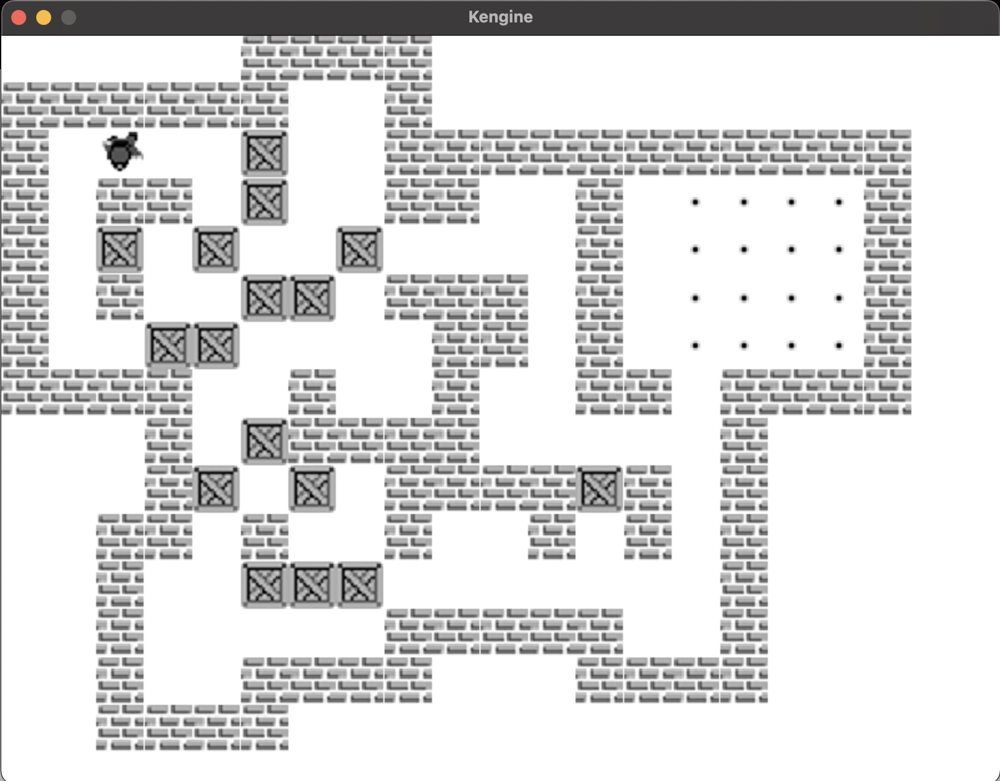

# Boxxle

Portable Sokoban-style Boxxle for Kengine.

## Modules

- `:games:boxxle-core`: shared `PortableGame` implementation and portable asset declarations.
- `:games:boxxle-desktop`: SDL desktop launcher using `PortableGameRunner`.
- `:games:boxxle-n64`: Nintendo 64 ROM wrapper using the N64 command-buffer backend.

## Controls

- **D-Pad / WASD / Arrows:** Movement
- **B / Start / Return:** Reset level
- **L / R:** Previous / next level

There are 41 levels total



## Build And Run

```shell
./gradlew :games:boxxle-core:jvmTest
./gradlew :games:boxxle-desktop:runDebugExecutableMacosArm64
```

```shell
./gradlew :games:boxxle-n64:buildN64Z64 -Pkengine.enableNintendo64=true
open -a ares games/boxxle-n64/build/n64/boxxle-n64.z64
```
