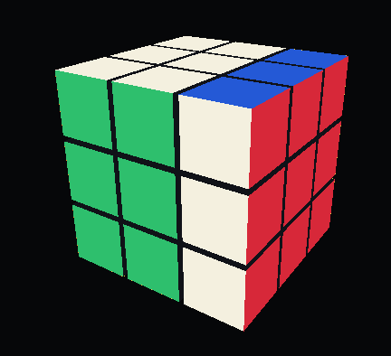

# Rubik's Cube 3D



Interactive 3D Rubik's cube demo with mouse controls, keyboard controls, and a local HTTP API for applying move notation.

## Local API

When the game is running, it starts a local API server:

```text
http://127.0.0.1:6464
```

All endpoints use `POST`. Responses are JSON and include `ok`, current `history`, and configured face `colors` when the command succeeds.

## Notation

`POST /3x3/apply` accepts notation with optional whitespace between moves. These are equivalent:

```text
UU'D'D
U U' D' D
F2B2U2D2L2R2
F2 B2 U2 D2 L2 R2
```

Suffixes must stay attached to the move letter:

- `'` means inverse, for example `F'`
- `2` means two quarter turns, for example `R2`

### BASIC Notation

`BASIC` supports face moves:

```text
U D L R F B
U' D' L' R' F' B'
U2 D2 L2 R2 F2 B2
```

Each face is interpreted as clockwise when looking directly at that face.

`BASIC` also supports whole-cube rotations, middle slices, and wide turns:

```text
x y z M E S
x' y' z' M' E' S'
x2 y2 z2 M2 E2 S2
u d l r f b
u' d' l' r' f' b'
u2 d2 l2 r2 f2 b2
```

`x`, `y`, and `z` rotate the whole cube. `M`, `E`, and `S` rotate middle slices. Lowercase moves are wide turns: the outer face plus the adjacent middle slice.

## Endpoints

### Apply Moves

If `type` is omitted, the API defaults to `BASIC`.

For BASIC notation, a plain text body is the simplest option when the sequence contains apostrophes:

```bash
curl -X POST http://127.0.0.1:6464/3x3/apply \
  -H 'Content-Type: text/plain' \
  -d "UU'D'D"
```

JSON bodies can use single quotes around the shell argument when the notation string does not contain apostrophes:

```bash
curl -X POST http://127.0.0.1:6464/3x3/apply \
  -H 'Content-Type: application/json' \
  -d '{"notation":"F2 B2 U2 D2 L2 R2"}'
```

For JSON that includes prime moves, use a heredoc to avoid shell escaping:

```bash
curl -X POST http://127.0.0.1:6464/3x3/apply \
  -H 'Content-Type: application/json' \
  --data-binary @- <<'JSON'
{"type":"BASIC","notation":"x y' z2 M E' S2 u r' f"}
JSON
```

Accepted JSON sequence keys are `notation`, `sequence`, `algorithm`, `moves`, or `notations`. `moves` and `notations` may be strings or arrays of strings.

### Reset

```bash
curl -X POST http://127.0.0.1:6464/3x3/reset
```

Clears the cube state and move history.

### Scramble

```bash
curl -X POST http://127.0.0.1:6464/3x3/scramble \
  -H 'Content-Type: application/json' \
  -d '{"turns":22}'
```

`turns` is optional and defaults to `22`.

### Colors

`POST /3x3/colors` updates any provided face colors. Face keys can be sent at the top level:

```bash
curl -X POST http://127.0.0.1:6464/3x3/colors \
  -H 'Content-Type: application/json' \
  -d '{"front":"00FF00","right":"FF0000","up":"F4F0DF"}'
```

Or wrapped in a `colors` object for a full palette update:

```bash
curl -X POST http://127.0.0.1:6464/3x3/colors \
  -H 'Content-Type: application/json' \
  -d '{"colors":{"front":"00FF00","back":"0000FF","right":"FF0000","left":"FF8C00","up":"FFFFFF","down":"FFFF00"}}'
```

Original palette:

```bash
curl -X POST http://127.0.0.1:6464/3x3/colors \
  -H 'Content-Type: application/json' \
  -d '{"colors":{"front":"2EBF6D","back":"2459D6","right":"D62839","left":"F28C28","up":"F4F0DF","down":"F5D547"}}'
```

High-contrast neon palette:

```bash
curl -X POST http://127.0.0.1:6464/3x3/colors \
  -H 'Content-Type: application/json' \
  -d '{"colors":{"front":"00F5D4","back":"7C3AED","right":"FF2E63","left":"FF9F1C","up":"F8F32B","down":"00BBF9"}}'
```

Supported face keys:

```text
front back right left up down
```

Colors are six-character RGB hex strings. A leading `#` is also accepted.
